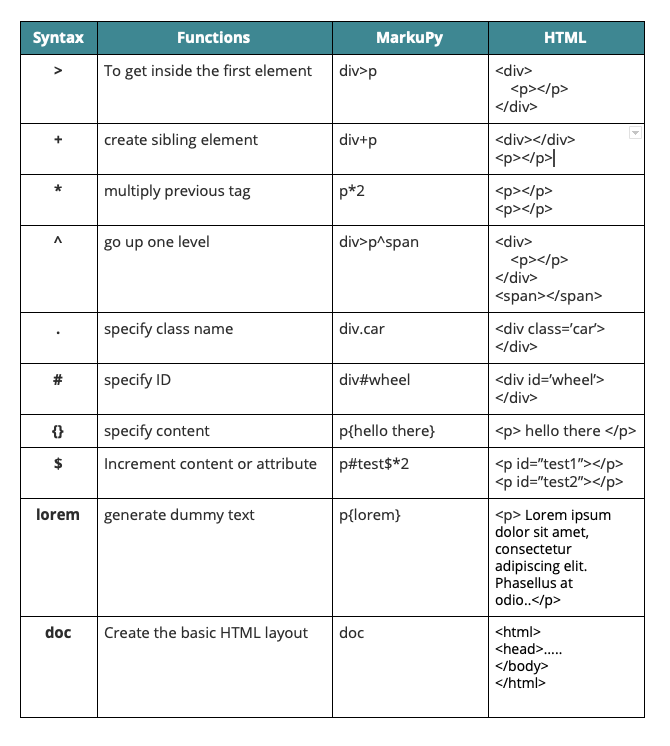

<p align="center">
  
</p>

--------------------------------------------------------------------
The name MarkuPy is inspired from the word mark-up and python. Mark-up comes from the HTML abbreviation while Python is the programming language we use for this project.

Markupy is a sublime plug-ins for text editors that allow for high-speed coding and editing in HTML and other structured code formats via content assist. It allows us to be more efficient and organized with our HTML code by creating appropriate indentation that are easy to read and understand.

The inspiration comes from emmet, a plugin that is available already in Visual Studio Code. Although having similarity in idea, we have our different syntax that suits our need.

Created for Analysis of Algorithms and Compiler Design final project.

Team members:
* [Figo Aranta - Github](https://github.com/figoaranta)
* [Amartya Saleh Kadarisman - Github](https://github.com/amartya18)
* [MarcAntonio Purnama - Github](https://github.com/marcantoniosmap)

## Example
Below is a simple example.


[Longer Demo Video](https://drive.google.com/file/d/1UGSovD3uagaxkWa0qcp_pNYbgIekuarx/view?usp=sharing)

## HTML Comparison
To get a better understanding below is a comparison with HTML.


## Language Syntax
MarkuPy syntax.



## How to Install
1. Clone or download zip of MarkuPy in to your sublime plugin directory.

`$ cd ~/Users/username/Library/Application\ Support/Sublime\ Text\ 3/Packages`

2. Open **Preferences > Key Bindings** and set any key binding combination you want. Below is an example of the format.
```
[
    {
        "keys": ["super+shift+c"],
        "command": "markupy"
    }
]
```
use any preferred keybinding.